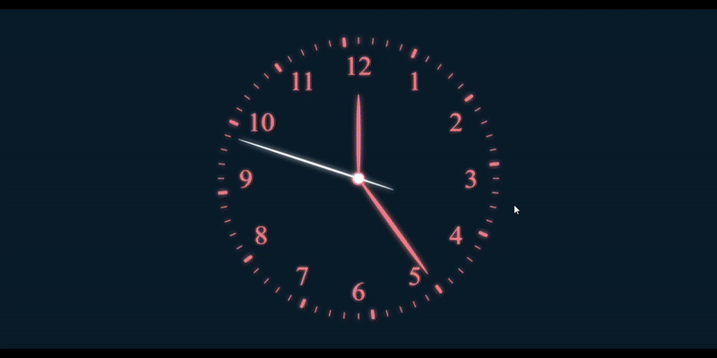

# 🕒 Analog Clock  

A fully functional analog clock built using HTML, CSS, and JavaScript. This project was created as practice to understand DOM manipulation, CSS animations, and working with JavaScript’s Date object.  

## ✨ Features  
- ⏱️ Dynamic hour numbers and second ticks generated using JavaScript  
- 🔄 Rotating hour, minute, and second hands that update in real-time  
- 🎨 Neon-style design with CSS animations (hue-rotate effect)  
- 🌐 No external libraries required — runs in any modern browser  

## 📂 Project Structure  
```

├── index.html   # Basic HTML structure
├── style.css    # Styling and animations
└── index.js     # Logic for creating clock elements and updating hands

```
## 📸 Screenshot  


## 🧠 What I Learned  
- Creating HTML elements dynamically using `insertAdjacentHTML`  
- Using CSS variables and transforms (`rotate`) for animations  
- Applying real-time updates with JavaScript’s Date object and `setInterval`  
- Understanding how analog clocks calculate hand angles (6° per second, 6° per minute, 30° per hour)  

## 🙌 Acknowledgments  
- **Inspiration:** A YouTube tutorial  
- **Code:** Fully written by me as a practice project *(no direct copy-paste)*  
